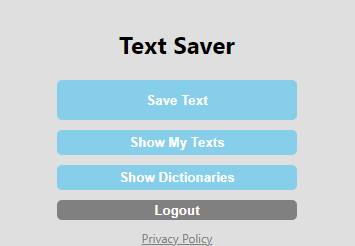
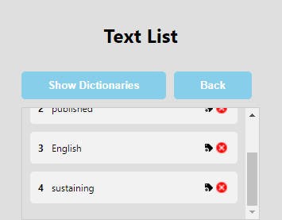
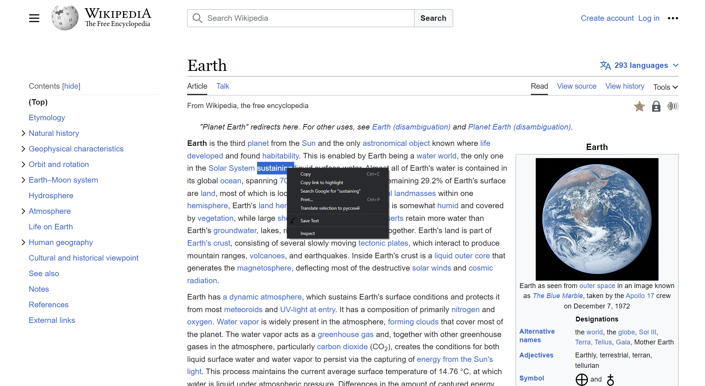

# Text Saver Browser Extension

## Description

The Text Saver Browser Extension is designed to enhance your browsing experience by offering powerful features to save and organize text-based content from web pages. Whether it's a memorable quote, a useful piece of information, or an inspiring passage, our extension enables you to capture and store these texts effortlessly for future reference.

## Features

* __Save Texts with Ease__: With just a click, you can save any selected text from a web page directly into the extension. No more copy-pasting into separate notes or documents.

* __Organize with Tags__: Create custom tags and categorize your saved texts according to topics, projects, or any classification that suits your needs.

* __Effortless Retrieval__: Easily search and find your saved texts by tags or keywords, ensuring quick access to the information you need.

* __Enhanced Productivity__: Stop juggling between tabs and documents. Use our extension to keep your important texts organized within your browser.

* __Secure Storage__: Your saved texts are stored locally within the extension, ensuring your privacy and data security.

* __Responsive Design__: The extension's user-friendly interface is responsive and adapts seamlessly to different screen sizes.

## Installation

To install extension as developer, download "frontend" directory and do the following steps:

1. Open Google Chrome or the Chromium-based browser you are using.

2. Open the Extensions page:
* For Chrome: Type chrome://extensions in the address bar and press Enter.
* For Microsoft Edge: Type edge://extensions in the address bar and press Enter.

3. Enable Developer mode:
* Look for a toggle switch labeled "Developer mode" in the top-right corner of the Extensions page. Turn it on.

4. Load the extension:
* Click on the "Load unpacked" or "Load unpacked extension" button that appears after enabling Developer mode.
* A file dialog will open. Navigate to the folder where your extension files are located (e.g., the root folder of your extension that contains the manifest.json file), and click "Select" or "Open."

5. Confirm installation:
* The extension should now be loaded and visible on the Extensions page.
* If there are no errors in the extension, it should be active and ready to use. You might also see the extension icon in the browser's toolbar.
* For using text saving from context menu you may need to reload your browser after instalation.

## How to use

1. Install the Text Saver Browser Extension from the Chrome Web Store.
2. When you come across a piece of text you want to save, simply select it.
3. Right-click and choose "Save Text" from the context menu to store the selected text or use "Save text" button im popup.
4. Assign relevant tags to organize your saved texts effectively.
5. Retrieve your saved texts quickly using the search feature or by filtering with tags.

## Screenshots

  
  

## Compatibility

The Text Saver Browser Extension is compatible with Google Chrome and other Chromium-based browsers.

## Privacy Policy

For information about data collection and usage, please refer to our privacy policy https://samsdimkoprojects.pro/text_saver/api/policy.

## Support

For any questions, feedback, or support inquiries, reach out to us at admin@samsdimkoprojects.pro.

Start saving and organizing your favorite texts with the Text Saver Browser Extension today!
